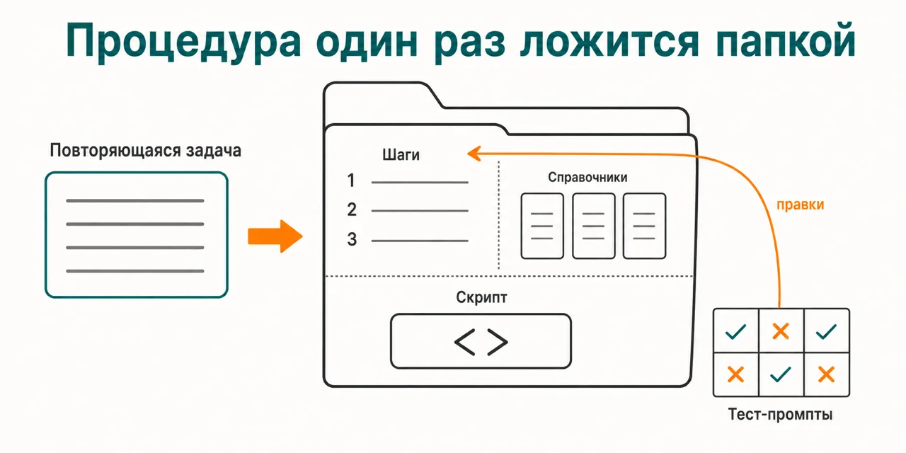
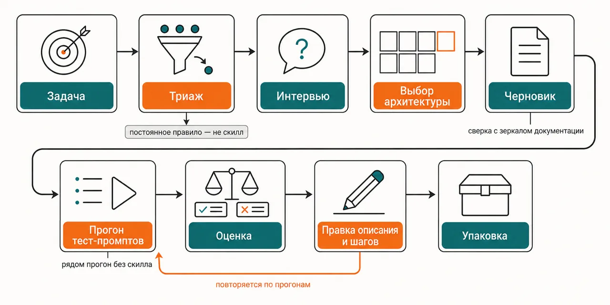

Русский · [English](README.en.md)

# Одну и ту же инструкцию ты вставляешь в чат заново, и каждый раз результат приходит в другом виде

Процедура один раз ложится папкой-скиллом: интервью очерчивает задачу, выбирается устройство скилла,
пишется черновик, по нему гоняются тест-промпты, а описание правится до тех пор, пока скилл не
начнёт включаться сам.

```
claude plugin marketplace add https://github.com/beCyborg/jadlis-start.git
claude plugin install skill-builder@jadlis
```

Ключей не нужно: плагин живёт на твоей подписке Claude Code. Это форк официального плагина Anthropic
`skill-creator`, переименованный — одноимённый плагин есть в маркетплейсе Anthropic, а два плагина с
одним именем делят один неймспейс.



Текстом: слева повторяющаяся задача словами, справа папка со скиллом — шаги, справочники, скрипт, —
и петля из тест-промптов, которая возвращает правки обратно в шаги.

Это моё рабочее место, выложенное как есть, а не продукт: чем перестал пользоваться — убрал.

## Было → стало

| Руками | Чатом с ИИ | Этим плагином |
|---|---|---|
| **Где живёт процедура.** Инструкция лежит в переписке и вставляется заново каждый заход. | Выполнит то, что вставил, и к следующему разу этого не помнит. | Кладёт процедуру папкой: `SKILL.md` с шагами, `references/` для деталей по требованию, `scripts/` для детерминированной части. |
| **Когда инструкция включается.** Вспоминать, что она вообще есть, приходится тебе. | Включается по твоей формулировке, и промах виден только по итогу. | Правит описание отдельным режимом: гоняет запросы, смотрит, сработал скилл или нет, и переписывает описание под срабатывание. |
| **Как понять, что скилл работает.** Судишь по последнему прогону, который помнишь. | Оценивает собственный результат в том же окне, где его и произвёл. | Прогоняет тест-промпты, оценивает их отдельной ролью-грейдером и сверяет с прогоном без скилла: не обогнал — не засчитан. |
| **Как устроен тяжёлый скилл.** Выбираешь устройство на глаз и переделываешь после первого фан-аута. | Собирает один длинный промпт: фан-аут, фон и расписание в него не помещаются. | Ведёт по семи архитектурам с матрицей выбора — инлайн, форк, субагенты, тонкий скилл плюс workflow, команда агентов, хуки, расписание. |
| **Что переживёт выгрузку наружу.** Пакет собран, а на загрузке падает на незнакомом поле. | Про ограничения формата не предупреждает. | Держит список из шести полей, которые живут вне Claude Code: валидатор предупреждает, упаковщик отказывается собирать непереносимое. |

## Как это работает



На входе — работа, которую ты повторяешь руками, и словами описанный результат.
Внутри — триаж отсекает то, что скиллом быть не должно, интервью добирает недостающее, черновик
сверяется с локальным зеркалом документации, а прогон по тест-промптам ставится рядом с прогоном
без скилла.
На выходе — папка со скиллом, тест-промпты к ней и разбор, где он не сработал.

Текстом: задача → триаж → интервью → выбор архитектуры → черновик → прогон тест-промптов → оценка →
правка описания и шагов → упаковка.

Держит внутри четыре роли: исполнитель гоняет скилл на задаче и отдаёт транскрипт, грейдер сверяет
результат с ожиданиями, компаратор сравнивает две версии вслепую, аналитик объясняет, почему одна
выиграла. Режимов четыре — создание, улучшение, eval и benchmark; benchmark гоняет каждый тест
трижды на конфигурацию и всегда добавляет прогон без скилла. Триаж работает и на отказ: то, что
должно применяться всегда, отправляется в `CLAUDE.md` или в хук, а не в скилл, который можно
пропустить. Подробности лежат в двадцати четырёх справочниках, читаются по требованию; отдельный
`house-style.md` перекрывает общие умолчания домашними конвенциями, а `AUDIT.md` держит реестр
фактов, продублированных между файлами, и дату последней сверки с документацией.

## Установка и первый запуск

**а) Текст для вставки агенту.** Скопируй целиком в чат Claude Code:

```
Ты — установщик. Поставь на этот Mac плагин skill-builder из маркетплейса jadlis.
Выполни ровно эти команды, дословно, ничего не сокращая:
1. claude plugin marketplace add https://github.com/beCyborg/jadlis-start.git
2. claude plugin install skill-builder@jadlis
3. claude plugin list — покажи мне строку про skill-builder и его версию.
Ключи этому плагину не нужны: он работает на подписке Claude Code, ничего вводить не надо.
Перед каждой командой покажи её мне целиком и дождись «да». Сказал «нет» — не выполняй,
скажи, что именно пропустил, и иди дальше.
Команда вернула ошибку — остановись, покажи вывод, к следующей не переходи.
```

**б) Команды руками.**

```
claude plugin marketplace add https://github.com/beCyborg/jadlis-start.git
claude plugin install skill-builder@jadlis
claude plugin list
```

Первая команда ничего не ставит — она добавляет маркетплейс. Ставит только вторая, и снимается
она одной строкой: `claude plugin uninstall skill-builder@jadlis --keep-data`.

**в) Короткая команда.** Открой Claude Code в папке, где работаешь, и набери:

```
/skill-builder
```

Не находится — сверь имя строкой `claude plugin list`. Дальше говори задачей: «сделай скилл для
<работа, которую повторяешь>» или «прогони eval для ~/skills/<имя>» — режим плагин выбирает сам.

## Границы, стоимость, обновление

**Чего не делает.** Не выпускает плагины: репозиторий по стандарту, валидация, версия, тег и релиз —
это соседний `plugin-creator` в собственном репозитории. Не превращает в скилл то, что скиллом быть
не должно: постоянно действующее правило триаж отправляет в `CLAUDE.md` или в хук. Не обещает
срабатывание — описание правится по прогонам, и результат каждый раз меряется заново. Не судит о
вкусовом: там, где выход субъективен, тест-кейсы не навязываются, а прогон разбирается руками.
Benchmark без субагентов недоступен — там остаётся eval по одному тесту. И не заменяет собой
документацию Claude Code: черновик сверяется с локальным зеркалом доков, а расходится с ним —
выигрывает зеркало.

**Что нужно.** Ключей и платных сервисов не нужно: всё идёт по твоей подписке Claude Code. Из
внешнего — сам `claude`, его скрипты вызывают подпроцессом на прогонах и правке описания, и `python3`
(скрипты держатся стандартной библиотеки, ставить нечего). Локальное зеркало документации в
`~/.claude-code-docs/` не обязательно: нет его — скилл идёт в официальные доки, но версии фич тогда
проверяются слабее. Своих API-ключей плагин не заводит и чужих счетов не создаёт.

**Порядок расхода токенов.** Создание скилла — разговор и правка файлов, расход лёгкий. Дороже
становится с первым прогоном: каждый тест-промпт — отдельный запуск, и рядом всегда идёт прогон без
скилла. Benchmark — тяжёлый прогон: десятки субагентов из твоей квоты, потому что каждый тест
повторяется трижды на конфигурацию. Улучшение занимает столько итераций, сколько ты разрешишь, —
границу задаёшь в начале, а не по факту.

**Апстрим.** Это форк официального плагина Anthropic `skill-creator`: автор оригинала — Anthropic, не
я. От апстрима форк ушёл интервью с триажем, руководством по семи архитектурам, протоколом сверки с
документацией, проверкой переносимости, реестром аудита и домашними конвенциями; сам апстрим по
записям в репозитории заморожен с 23.04.2026.

[уточнить] — прямой ссылки на репозиторий оригинала в этом репозитории нет.

**Проверено там, где я работаю:** мой Mac, моя подписка. Где ещё это работает — [уточнить].

**Условия использования.** Форк официального плагина Anthropic, лицензия Apache-2.0 — текст в файле
[LICENSE](LICENSE).

**Обновление.** У стороннего маркетплейса авто-обновление на твоей стороне выключено: пока не
запустишь первую команду, у тебя остаётся та версия, которую ты поставил.

```
claude plugin marketplace update jadlis
claude plugin update skill-builder@jadlis
claude plugin list
```

Переустановка, если что-то встало криво:

```
claude plugin uninstall skill-builder@jadlis --keep-data && claude plugin install skill-builder@jadlis
```

Установки, сделанные под старым именем `skill-creator`, переезжают сами: переименование прописано в
манифесте маркетплейса и подхватывается при обновлении.
